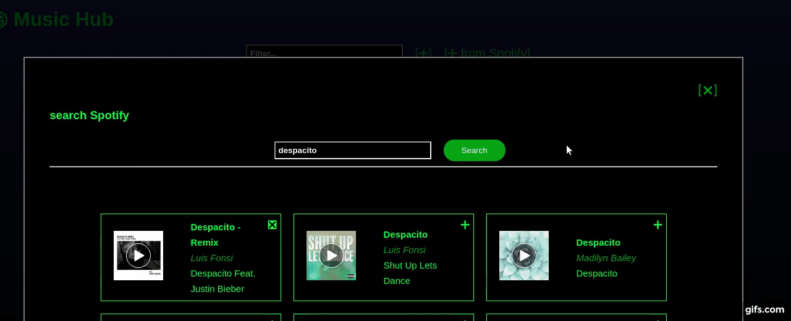
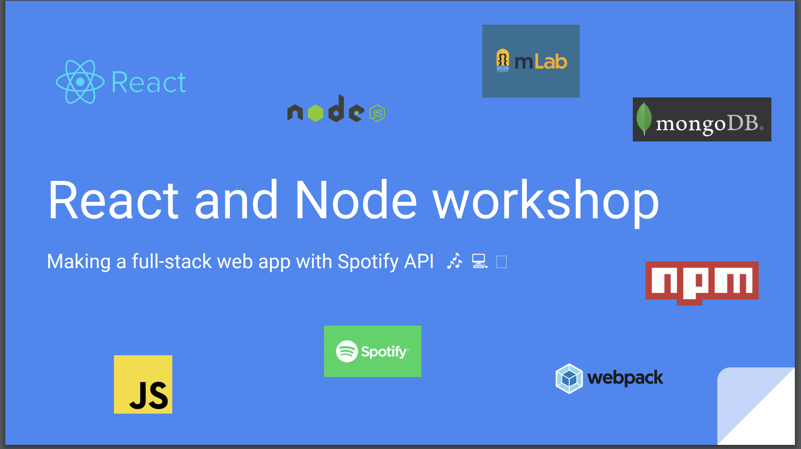

# React + Node workshop

### with MongoDB, mLab, SpotifyAPI

### We will be building **MusicHub**

It's a CRUD playlist inspired by Spotify. It uses Spotify's 30-second track embeds,
as well as Spotify API for searching.


### Preview:




### To learn:
Follow the slides workshop at https://github.com/lenmorld/rnw/raw/master/react_node_workshop_slides.pdf
and join the Slack channel!


### To try/dev:
```
# fork and clone the repo to your local
$ npm install
$ npm start 

# in a 2nd terminal
$ webpack --watch
```


### Slides

[](https://github.com/lenmorld/rnw/raw/master/react_node_workshop_slides.pdf)


### Contributing

This repo and the material is being continously developed. 
To contribute, check out Issues or create a new one, 
fork repo, and make a PR against this one.
Thanks!
